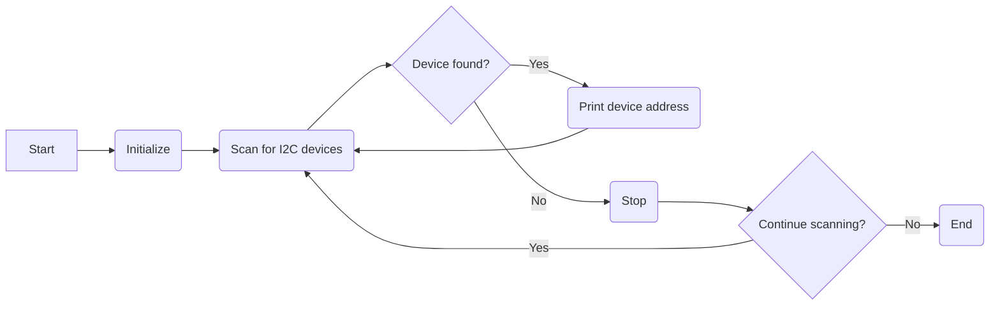

# I2C Device Scanner

This is a simple Arduino sketch that scans for I2C devices connected to your Arduino board. It uses the `Wire` library to communicate over the I2C bus and identifies the devices by their respective addresses.

## Prerequisites

To run this code, you will need:

- An Arduino board (e.g., Arduino Uno, Arduino Mega, etc.)
- The Arduino IDE or a compatible development environment
- The `Wire` library (usually included with the Arduino IDE)

## Setup

1. Connect your Arduino board to your computer using a USB cable.
2. Open the Arduino IDE or your preferred development environment.
3. Create a new sketch and copy the provided code into the sketch window.

## Wiring

No additional wiring is required for this sketch. The I2C bus is typically available on the dedicated pins of the Arduino board (e.g., A4 for SDA and A5 for SCL). Ensure that your I2C devices are properly connected to the corresponding pins.

## Usage

1. Upload the sketch to your Arduino board by clicking the "Upload" button or selecting the appropriate option from the IDE menu.
2. Open the serial monitor by clicking the magnifying glass icon or selecting "Tools" > "Serial Monitor" from the IDE menu.
3. Set the baud rate of the serial monitor to `115200` to match the `Serial.begin(115200)` call in the code.
4. After uploading, you should see the serial monitor displaying "Scanning..." messages periodically.

## How it Works

1. In the `setup()` function, the serial communication is initialized with a baud rate of `115200`, and the I2C bus is started using the `Wire.begin()` function.
2. The `loop()` function is executed repeatedly, scanning for I2C devices every second (`delay(1000)`).
3. The code uses a `for` loop to iterate through all possible I2C addresses (0 to 127).
4. Inside the loop, it starts a transmission to each address using `Wire.beginTransmission()`.
5. It then checks for any errors in the transmission by calling `Wire.endTransmission()` and storing the return value in the `error` variable.
6. If the `error` is equal to `0`, it means the device responded and is present at that address.
7. In such cases, the code prints a message to the serial monitor indicating that a device was found at the specific address (`0x` followed by the address in hexadecimal format).

## Flowchart 

## Note

- This code assumes that all the devices connected to the I2C bus have a unique address within the range of 0 to 127. Some devices have fixed addresses, while others may have configurable addresses using jumpers or software settings. Make sure your devices are properly configured or consult their documentation for the correct addresses.
